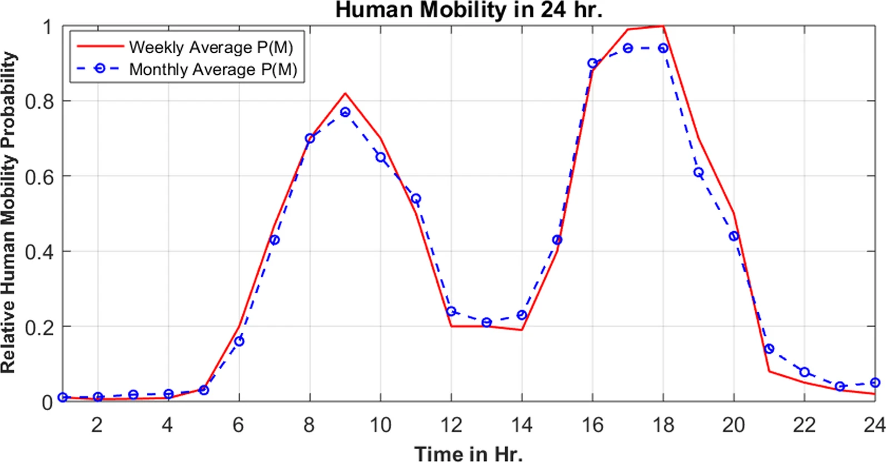
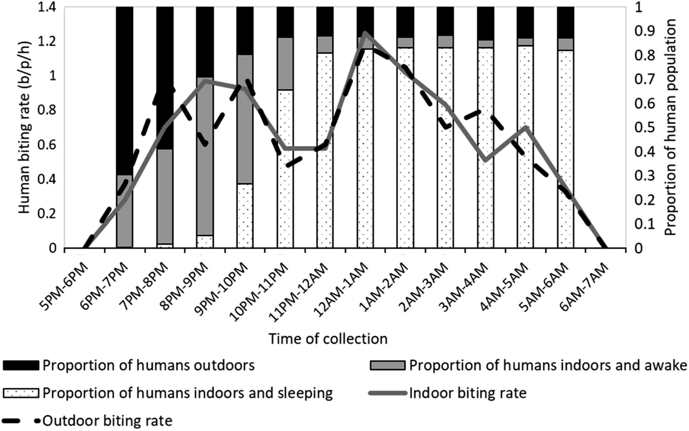

# Activity Spaces

This repository hosts code, data workflows, and documentation for research on **activity spaces** — the multiple locations where people spend time and how these spaces influence health outcomes, especially for infectious diseases.  

I began thinking about activity spaces when I was in graduate school learning GIS and spatial analytic approaches, and how to *think spatially* under the mentorship of [Stephen Matthews](https://www.geog.psu.edu/directory/stephen-matthews). In particular, his work on *spatial polygamy* shaped how I conceptualize people's relationship to place:

> Matthews, S.A. (2011). *Spatial Polygamy and the Heterogeneity of Place: Studying People and Place via Egocentric Methods.* In: Burton, L., Matthews, S., Leung, M., Kemp, S., Takeuchi, D. (eds) *Communities, Neighborhoods, and Health.* Social Disparities in Health and Health Care, vol 1. Springer, New York, NY. [https://doi.org/10.1007/978-1-4419-7482-2_3](https://doi.org/10.1007/978-1-4419-7482-2_3)

Stephen’s main focus was on U.S. social science, where individuals in data are often linked to census tracts or blocks. In my own work, I sometimes have much more spatial detail — for example GPS coordinates for a participant’s house. In a census or survey, we might have individuals linked to houses, many houses in a community, several communities in a region, and so on. With such data, we can map disease cases to households and create incidence or prevalence maps.  

Inherent in such maps is the assumption that the **mapped location is important for the process being studied** — in infectious disease epidemiology, this often means *transmission*. For example, a map of incidence by household might reveal clustering patterns, suggesting local transmission at or near those homes. We don't always state this assumption, but otherwise why show cases per home?

However, **few people spend all of their time at home**. This is Stephen’s point: we are *“married”* to multiple places. We might spend significant time at school, work, or places of worship — all of which could be important for transmission — but these sites are almost never in our datasets or maps.

---

## Applications in My Research

This line of thinking has inspired several branches of my research program:

### 1. **Farm huts and seasonal labor movement**

In Southeast Asia, many farmers have **farm huts** near their fields, where they stay during peak agricultural labor periods (often easier than returning home daily). These periods often coincide with seasonal peaks in disease transmission — for example, **malaria season overlaps with rice farming season**.

  
**Figure 1.** *Agricultural activities by season in malarious rural areas on the Thailand–Myanmar border. Malaria tends to peak in July–August each year, and occasionally there is a second peak in November.*

One approach I’ve taken is to map farm huts in study villages (from our [tMDA work](https://github.com/DMParker1/tmda-program)), link them to their respective households, and look for spatial and temporal patterns in malaria infections that incorporate both home and farm hut locations.  

- Parker, D.M., Landier, J., von Seidlein, L. et al. (2016). *Limitations of malaria reactive case detection in an area of low and unstable transmission on the Myanmar–Thailand border.* **Malar J** 15, 571. [https://doi.org/10.1186/s12936-016-1631-9](https://doi.org/10.1186/s12936-016-1631-9)

  
**Figure 2.** *Example of mapped farm huts linked to households for spatial epidemiological analysis.*

---

### 2. **Earth observation data and exposure buffers**

Earth observation datasets (often rasters) are usually linked to individuals via their home location, sometimes using a **buffer** around the home to capture environmental conditions ([here’s a tool to do this yourself](https://github.com/CatalinaMedina/aedes-serology/blob/main/helper-functions/process-modis-data-function.R)). The buffer size is important — too small, and you miss relevant exposures; too large, and you dilute the signal. Movement ranges of residents should inform these choices.

- Rattanavong, S., Dubot-Pérès, A., Mayxay, M., Vongsouvath, M., Lee, S.J., et al. (2020). *Spatial epidemiology of Japanese encephalitis virus and other infections of the central nervous system in Lao PDR (2003–2011): A retrospective analysis.* **PLOS Negl Trop Dis** 14(5): e0008333. [https://doi.org/10.1371/journal.pntd.0008333](https://doi.org/10.1371/journal.pntd.0008333)

  
**Figure 3.** *Environmental indices for villages with study patient homes for the duration of the study period (January 2003 through August 2011) for all study patient villages, non-study patient villages in the study area, and for major diagnoses (LP = lumbar puncture; JEV = Japanese Encephalitis virus; Crypto = cryptococcal infection; ST = scrub typhus; MT = murine typhus; dengue = Dengue virus; lepto = Leptospira spp. infection). The buffer size used influences the summary measures of the environmental measure (A: normalized flooding index, NFI; B: normalized difference vegetation index, NDVI; C. enhanced vegetation index, EVI).*

- Roberts, T., Parker, D.M., Bulterys, P.L., Rattanavong, S., Elliott, I., et al. (2021). *A spatio-temporal analysis of scrub typhus and murine typhus in Laos: implications from changing landscapes and climate.* **PLOS Negl Trop Dis** 15(8): e0009685. [https://doi.org/10.1371/journal.pntd.0009685](https://doi.org/10.1371/journal.pntd.0009685)

---

### 3. **GPS logger studies**

Another approach is to measure actual human movement directly using **GPS loggers** in cohort studies. This is logistically complex but provides rich movement data.  
Analysis for one such study — *Human movement patterns of farmers and forest workers from the Thailand–Myanmar border* — is documented in a repository built and maintained by my student and collaborator (S.T.T Tun): [HumMovPatt](https://github.com/SaiTheinThanTun/HumMovPatt).

- Tun, S.T.T., Min, M.C., Aguas, R. et al. (2023). *Human movement patterns of farmers and forest workers from the Thailand–Myanmar border* [version 2; peer review: 2 approved, 2 approved with reservations]. **Wellcome Open Res** 6:148. [https://doi.org/10.12688/wellcomeopenres.16784.2](https://doi.org/10.12688/wellcomeopenres.16784.2)

  
**Figure 4.** *GPS tracks from 3 cohort study participants (indicated by different colors). Successive GPS logs are linked with lines to indicate relative movement.*

### 4. **Mobile phone data for large-scale movement patterns**

GPS loggers are great for detailed studies, but they cover few people. To scale up, we’ve used **mobile phone handover data**, which can capture large portions of the population. With colleagues at Addis Ababa University and EThiotelecom, we analyzed when people move by time of day and compared this to the biting times of local mosquito vectors. We found that many people are moving during peak biting hours — meaning interventions like bednets, which only protect when you’re home and under them, can be “leaky.”

- Haileselassie, W., Getnet, A., Solomon, H. et al. (2022). *Mobile phone handover data for measuring and analysing human population mobility in Western Ethiopia: implication for malaria disease epidemiology and elimination efforts.* **Malar J** 21, 323. [https://doi.org/10.1186/s12936-022-04337-w](https://doi.org/10.1186/s12936-022-04337-w)

  
  
**Figure 5.** *Human mobility patterns in relation to mosquito biting times (from human landing catches) in Gambella Region, Ethiopia. Human mobility derived from mobile phone handover data, indicating plenty of movement during times when mosquito vectors are active.*

---

## Planned Additions

This repository will soon include:
- **Code examples** for incorporating multiple activity spaces into spatial epidemiology analyses

---

---

## 🔗 Related Repositories

These repositories connect different parts of my spatial epidemiology research:

- [spatial-epidemiology-hub](https://github.com/DMParker1/spatial-epidemiology-hub) — Umbrella repository tying together my career arc.  
- [earth-observation-hub](https://github.com/DMParker1/earth-observation-hub) — How Earth Observation methods became central to my work, with curated papers and case studies.  
- [activity-spaces](https://github.com/DMParker1/activity-spaces) — Research on multi-place exposure (farm huts, GPS, mobile phone data) and its health relevance.  
- [METF-mapping](https://github.com/DMParker1/METF-mapping) — Mapping malaria post placement & community engagement.  
- [tMDA-program](https://github.com/DMParker1/tmda-program) — Targeted mass drug administration trials & modeling.  
- [early-dx-tx](https://github.com/DMParker1/early-dx-tx) — Early access to malaria diagnosis & treatment.  
- [tm-border-mch](https://github.com/DMParker1/tm-border-mch) — Maternal and child health research on the Thailand–Myanmar border.  

---

## License

Unless otherwise noted, materials in this repository are licensed under the MIT License.
